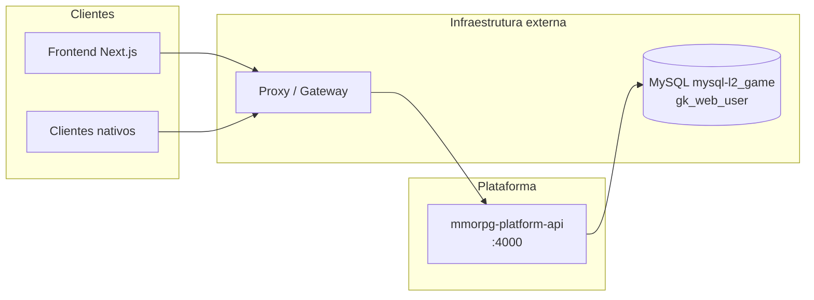
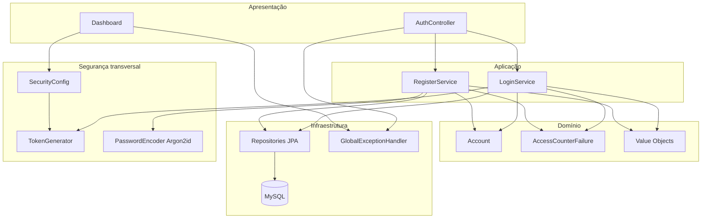
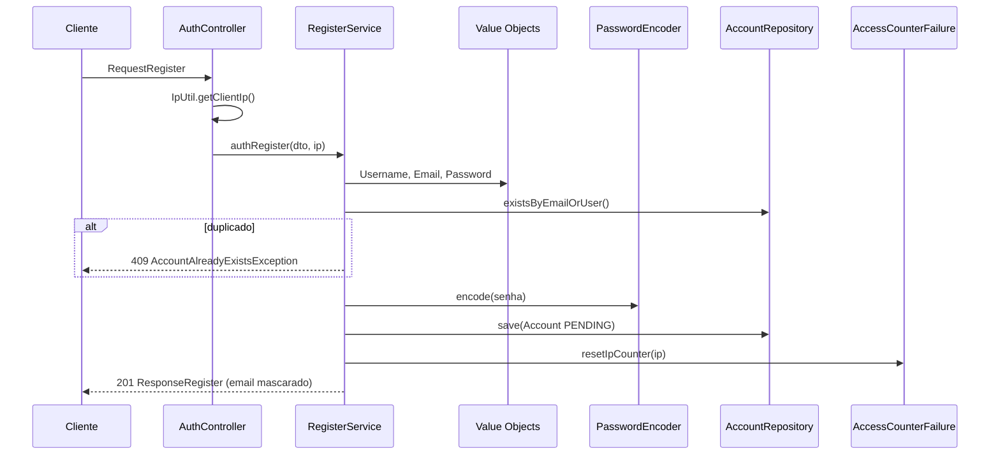
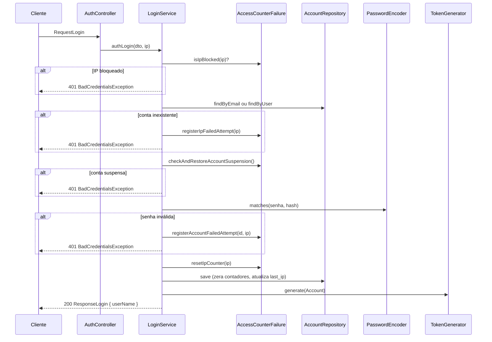
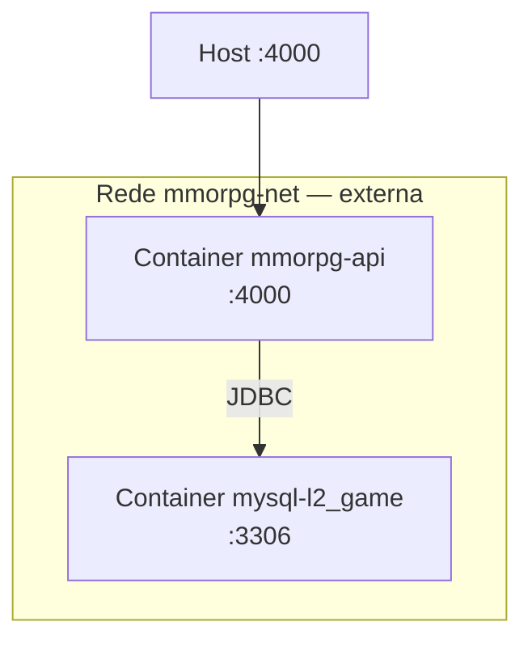

# Grankain Platform API — Arquitetura

> **Projeto:** `mmorpg-platform-api`  
> **Versão:** `0.0.1-SNAPSHOT`  
> **Última atualização:** 2026-05-26  
> **Porta padrão:** `4000`

---

## 1. Contexto do Sistema

A **Grankain Platform API** é o backend REST da plataforma MMORPG (Lineage 2). Nesta fase, o serviço concentra-se em **autenticação, registro e proteção de contas de jogadores**, consumido principalmente por um frontend web (Next.js) e, futuramente, por clientes nativos.



### 1.1 Responsabilidades atuais

| Domínio | Responsabilidade | Status |
|---|---|---|
| **Auth** | Registro, login, emissão/validação JWT, brute-force | Implementado |
| **Dashboard** | Endpoints protegidos para área autenticada | Stub inicial |
| **Infra** | Erros padronizados, validações customizadas, mascaramento | Implementado |
| **Security** | Spring Security, CORS, Argon2id, headers defensivos | Implementado |

### 1.2 Fora de escopo nesta versão

- Verificação de e-mail (double opt-in)
- Validação de reCAPTCHA no backend
- Refresh token
- Módulo de posts (`/posts/**` já liberado na segurança, sem implementação)
- Observabilidade estruturada (ELK, Loki, etc.)

---

## 2. Estilo Arquitetural

O projeto adota um **monólito modular** com fronteiras inspiradas em **Clean Architecture** e **Domain-Driven Design (DDD)**:

- **Domínio rico:** regras de negócio em entidades e componentes de domínio (`Account`, `AccessCounterFailure`).
- **Camadas explícitas:** controller → service (aplicação) → repository (infraestrutura de persistência).
- **Fronteira via DTOs:** entidades JPA nunca são expostas diretamente na API.
- **Value Objects embarcados:** `Email`, `Username` e `Password` como Records `@Embeddable`.
- **Injeção por construtor:** services, controllers e configs evitam `@Autowired` em campo.



---

## 3. Estrutura de Pacotes

```
com.grankain.platformapi
│
├── auth/                          # Bounded context: autenticação
│   ├── controller/                # Entry points HTTP
│   ├── domain/                    # Entidades, enums, VOs, lógica de domínio
│   │   ├── login/
│   │   │   └── AccessCounterFailure.java
│   │   └── vo/
│   ├── dto/                       # Contratos request/response da API
│   ├── exceptions/                # Exceções de domínio
│   ├── repository/                # Spring Data JPA
│   └── service/                   # Casos de uso (orquestração)
│
├── dashboard/                     # Bounded context: área autenticada (inicial)
│   └── controller/
│
├── config/
│   └── DatabaseConfig.java        # DataSource e JPA do banco de login
│
├── infra/                         # Cross-cutting de infraestrutura
│   ├── exception/                 # GlobalExceptionHandler + DTOs de erro
│   ├── util/                      # DataMasker
│   └── validation/                # @ValidUser, @ValidPassword
│
├── security/                      # Cross-cutting de segurança
│   ├── SecurityConfig.java
│   ├── PasswordEncoderConfig.java
│   └── TokenGenerator.java
│
└── util/
    └── IpUtil.java                # Extração de IP do cliente
```

### 3.1 Convenções

| Aspecto | Convenção |
|---|---|
| Entidade raiz | `Account` (aggregate root do contexto auth) |
| Persistência | `ddl-auto: validate` — schema gerenciado externamente |
| Transações | `@Transactional` nos services; `REQUIRES_NEW` em contadores de falha |
| Erros | `GlobalExceptionHandler` com hardening em profile `prod` |
| Perfis | `dev` (detalhes de erro) e `prod` (resposta mínima) |

---

## 4. Modelo de Dados

### 4.1 Entidades

#### `accounts` — Aggregate Root

| Campo | Tipo | Observação |
|---|---|---|
| `id` | `UUID` | PK (`GenerationType.UUID`) |
| `name` | `String` | Nome completo capitalizado no construtor |
| `email` | `Email` (VO) | `@Embedded`, unique |
| `birthday` | `LocalDate` | Formato `YYYY-MM-DD` |
| `username` | `Username` (VO) | `@Embedded` |
| `status` | `AccountStatus` | `PENDING`, `ACTIVE`, `SUSPENDED`, `BANNED` |
| `password` | `String` | Hash Argon2id |
| `created_at` | `Instant` | `@CreationTimestamp` |
| `accessed_at` | `Instant` | `@UpdateTimestamp` |
| `failed_access_counter` | `int` | Tentativas falhas de login |
| `failed_at` | `Instant` | Timestamp da última falha |
| `last_ip` | `String` | Último IP de acesso bem-sucedido |
| `access` | `UserAccess` | `USER`, `ADM`, `MODERATOR` |

#### `block_ip_user` — Controle de brute-force por IP

| Campo | Tipo | Observação |
|---|---|---|
| `ip_user` | `String` | PK (endereço IP) |
| `count` | `int` | Tentativas falhas acumuladas |
| `block_at` | `Instant` | Início da janela de bloqueio |

As tabelas **não possuem FK entre si**. Bloqueio por conta e por IP são mecanismos ortogonais coordenados por `AccessCounterFailure`.

### 4.2 Value Objects

| VO | Regras |
|---|---|
| `Email` | Validação RFC-compatível no construtor compacto |
| `Username` | 5–12 caracteres alfanuméricos |
| `Password` | Complexidade via `@ValidPassword` no DTO de entrada |

### 4.3 Persistência

- **Banco:** MySQL (`gk_web_user`), container externo `mysql-l2_game`.
- **Configuração:** `DatabaseConfig` define `loginDataSource`, `loginEntityManagerFactory` (PU: `LoginPU`) e `loginTransactionManager`.
- **Repositórios:** escaneados em `com.grankain.platformapi.auth.repository`.
- **Lock pessimista:** `BlockIpUserRepository.findWithLockByIpUser` para concorrência em contadores de IP.

---

## 5. Fluxos Principais

### 5.1 Registro (`POST /auth/register`)



**Regras de negócio:**

- Conta criada com status `PENDING` e role `USER`.
- Transação com `Isolation.SERIALIZABLE` para evitar race condition de duplicidade.
- E-mail retornado é mascarado via `DataMasker` no construtor de `ResponseRegister`.
- Campo `recaptchaToken` existe no DTO, mas **validação backend ainda não implementada**.

### 5.2 Login (`POST /auth/login`)



**Observação arquitetural:** o `TokenGenerator` emite JWT HS256 após login bem-sucedido, porém o DTO `ResponseLogin` atual expõe apenas `userName`. A integração completa com o frontend depende de incluir o token na resposta (ou header `Authorization`).

### 5.3 Proteção contra brute-force

| Gatilho | Limiar | Duração | Ação |
|---|---|---|---|
| Falhas de senha na conta | ≥ 5 | 5 minutos | Status → `SUSPENDED`; reativação automática após expirar |
| Falhas de login por IP | ≥ 7 | 15 minutos | Bloqueio temporário; registro removido após expirar |
| Login bem-sucedido | — | — | Zera contadores de conta e IP |

`AccessCounterFailure` usa transações `REQUIRES_NEW` para isolar incrementos de falha e evitar problemas de entidade detached entre sessões Hibernate.

---

## 6. Arquitetura de Segurança

### 6.1 Modelo de autenticação

| Aspecto | Implementação |
|---|---|
| Sessão | Stateless (`SessionCreationPolicy.STATELESS`) |
| Token | JWT HS256 via OAuth2 Resource Server |
| Emissão | `TokenGenerator` + `JwtEncoder` (Nimbus) |
| Validação | `JwtDecoder` em todas as rotas autenticadas |
| Segredo | Variável de ambiente `JWT_SECRET_KEY` |

**Claims do JWT:**

```
iss   : "mmorpg-l2-api"
iat   : timestamp de emissão
exp   : iat + 3600s (1 hora)
sub   : username do jogador
scope : "ROLE_USER" | "ROLE_ADM" | "ROLE_MODERATOR"
```

### 6.2 Autorização de rotas

| Rota | Método | Acesso |
|---|---|---|
| `/auth/register`, `/auth/login` | POST | Público |
| `/posts/**` | GET | Público (reservado para módulo futuro) |
| `/v3/api-docs`, `/error` | GET/POST | Público |
| `/dashboard/**` | POST | Autenticado (Bearer JWT) |
| Demais rotas | * | Autenticado |
| `OPTIONS /**` | OPTIONS | Público (preflight CORS) |

`@EnableMethodSecurity` está habilitado para uso futuro de `@PreAuthorize` / `@PostAuthorize`.

### 6.3 Hash de senhas

Algoritmo **Argon2id** (`Argon2PasswordEncoder`):

```
saltLength=16, hashLength=32, parallelism=1, memory=60000 (60 MB), iterations=10
```

Provider: Bouncy Castle (`bcprov-jdk18on` 1.84).

### 6.4 CORS e headers

- **CORS:** origens lidas de `SPRING_APPLICATION_CORS_ORIGINS` (vírgula-separadas).
- **Métodos permitidos:** `GET`, `POST`.
- **Headers:** `Authorization`, `Content-Type`, `Accept`.
- **Headers HTTP defensivos:** `X-Content-Type-Options: nosniff`, `X-Frame-Options: DENY`.
- **HSTS:** habilitado apenas no profile `prod`.

### 6.5 Tratamento de erros

`GlobalExceptionHandler` (`@ControllerAdvice`):

| Profile | Comportamento |
|---|---|
| `dev` | Timestamp, status, mensagem, path e stack trace filtrado (até 8 frames do projeto) |
| `prod` | Apenas campo `error` (ex.: `UNAUTHORIZED`) — mitiga CWE-200 |

### 6.6 Extração de IP

`IpUtil` usa `request.getRemoteAddr()` com `server.forward-headers-strategy: native`, confiando no proxy/gateway para propagar o IP real de forma segura (sem ler headers forjáveis diretamente).

---

## 7. Stack Tecnológica

| Camada | Tecnologia | Versão |
|---|---|---|
| Runtime | Java (Eclipse Temurin) | 21 LTS |
| Framework | Spring Boot | 3.5.14 |
| Web | spring-boot-starter-web | via Boot |
| Segurança | Spring Security + OAuth2 Resource Server | via Boot |
| Persistência | Spring Data JPA + Hibernate | via Boot |
| Banco | MySQL Connector/J | via Boot |
| Criptografia | Argon2id + Bouncy Castle | 1.84 |
| Validação | Jakarta Bean Validation | via Boot |
| Observabilidade | Spring Actuator (`/actuator/health`) | via Boot |
| Documentação API | springdoc-openapi | 2.8.5 (marcado para remoção) |
| Build | Maven Wrapper | via Boot parent |
| Container | Docker multi-stage (JDK → JRE Alpine) | — |

---

## 8. Infraestrutura e Deploy

### 8.1 Topologia Docker



- **Compose:** `docker-compose.yml` gerencia apenas a API.
- **Banco:** container `mysql-l2_game` e rede `mmorpg-net` são pré-requisitos externos.
- **Imagem:** build multi-stage; processo executado como usuário não-root (`appuser`).

### 8.2 Variáveis de ambiente

| Variável | Função |
|---|---|
| `SPRING_PROFILES_ACTIVE` | Profile Spring (`dev` / `prod`) |
| `LOGIN_DB_URL` | JDBC URL do MySQL |
| `LOGIN_DB_USER` / `LOGIN_DB_PASS` | Credenciais do banco |
| `SPRING_APPLICATION_CORS_ORIGINS` | Origens CORS permitidas |
| `JWT_SECRET_KEY` | Segredo HMAC para JWT |

Referência: `.env.example`.

### 8.3 Health check

```
GET /actuator/health → { "status": "UP" }
```

---

## 9. Testes

Estratégia atual focada em **testes unitários** com JUnit 5 e Mockito:

| Área | Classes de teste |
|---|---|
| Value Objects | `EmailTest`, `UsernameTest`, `EncodedPasswordTest` |
| Services | `LoginServiceTest`, `RegisterServiceTest` |
| Domínio | `AccessCounterFailureTest` |

Testes usam profile/config em `src/test/resources/application-dev.yaml` (H2 em arquivo local).

---

## 10. Dívida Técnica e Evolução

Itens identificados no código atual que impactam a arquitetura:

| Item | Impacto | Prioridade sugerida |
|---|---|---|
| JWT gerado mas não retornado em `ResponseLogin` | Frontend não recebe token após login | Alta |
| `BlockedIpException` definida, não integrada ao fluxo | Exceção de domínio sem handler dedicado | Média |
| reCAPTCHA no DTO sem validação backend | Registro vulnerável a bots | Média |
| `System.out.println` em `LoginService` | Vazamento de credenciais em logs | Alta |
| Módulo `/posts/**` liberado sem implementação | Superfície de API incompleta | Baixa |
| `springdoc-openapi` com comentário "Remover" | Dependência transitória desnecessária | Baixa |
| `documentation/security.md` desatualizado (menciona HTTP Basic) | Documentação divergente | Baixa |

### Roadmap arquitetural

1. **Completar contrato de login** — retornar JWT em `ResponseLogin` ou header padronizado.
2. **Ativar reCAPTCHA** — serviço de validação externa no registro.
3. **Refresh token** — rotação de tokens sem novo login.
4. **Verificação de e-mail** — transição `PENDING` → `ACTIVE`.
5. **Observabilidade** — logs estruturados, métricas e tracing distribuído.
6. **Modularização futura** — extrair bounded contexts (auth, dashboard, content) se a carga ou o time crescer.

---

## 11. Documentação Relacionada

| Documento | Conteúdo |
|---|---|
| [`documentation/technical-overview.md`](documentation/technical-overview.md) | Visão técnica detalhada, endpoints e getting started |
| [`documentation/api-integration-guide-frontend.md`](documentation/api-integration-guide-frontend.md) | Guia de integração para o frontend |
| [`documentation/security.md`](documentation/security.md) | Políticas de segurança (parcialmente desatualizado) |
| [`README.md`](README.md) | Quick start e referência rápida |

---

## 12. Decisões Arquiteturais (ADR resumido)

| Decisão | Alternativa considerada | Motivo da escolha |
|---|---|---|
| Monólito modular DDD | Microserviços desde o início | Escopo inicial pequeno; menor complexidade operacional |
| JWT stateless HS256 | Sessão server-side / OAuth2 completo | Escalabilidade horizontal; simplicidade para SPA |
| Argon2id | BCrypt | Resistência superior a GPU/ASIC (OWASP) |
| MySQL externo ao compose | Banco no mesmo compose | Reutiliza infraestrutura existente do jogo (`mysql-l2_game`) |
| `ddl-auto: validate` | `update` / Flyway interno | Schema gerenciado pela equipe de banco; evita drift acidental |
| Erros hardened em `prod` | Mesma resposta em todos os ambientes | Reduz information exposure (CWE-200) |
| Bloqueio temporário auto-expirável | Bloqueio permanente | Equilibra segurança e experiência do jogador |
